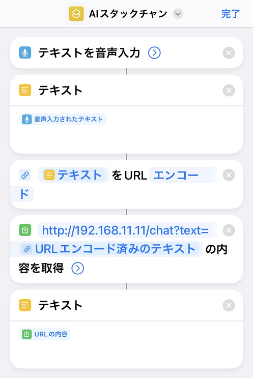

# M5Unified_StackChan_ChatGPT
“AI Stack Chan 与 ChatGPT API”。

  

这是与@mongonta555的[Stack Chan M5GoBottom版本组装套件]（https://raspberrypi.mongonta.com/about-products-stackchan-m5gobottom-version/“标题”）相对应的Stack Chan Farm。  

我正在使用 HOYA 提供的 [VoiceText Web API 服务](https://cloud.voicetext.jp/webapi "Title") 进行文本转语音 (TTS)。  
VoiceText TTS 基于 kghrlabo 的 esp32_text_to_speech。  
这是原文。  
esp32_text_to_speech <https://github.com/kghrlabo/esp32_text_to_speech> 

---

### 制作 M5GoBottom 版本 Stack Chan 需要什么以及如何制作 ###
看这里。  
*[Stackchan M5GoBottom版本组装套件](https://raspberrypi.mongonta.com/about-products-stackchan-m5gobottom-version/"标题") 

### 构建程序需要什么###
*[M5Stack Core2](http://www.m5stack.com/“标题”) 
*VSCode 
*平台IO 

使用的库请参考“platformio.ini”。  

---

### 使用伺服电机设置 GPIO 编号 ###
*在M5Unified_StackChan_ChatGPT.ino第42行附近，设置GPIO编号以使用伺服电机。

### 获取 ChatGPT 的 API 密钥 ###

ChatGPT的API key获取方法如下。 （有关详细信息，请参阅本页底部的链接。）

*访问[OpenAI网站](https://openai.com/“标题”)并创建一个帐户。需要电子邮件地址和手机号码。
*创建帐户后，将颁发API密钥。 API 密钥是付费的，但有免费期和积分。  

### 获取 VoiceText Web API api 密钥 ###
如果您从[此处](https://cloud.voicetext.jp/webapi/“标题”)的“免费注册”下申请，API 密钥将通过电子邮件发送给您。  
*有关 TTS 参数的详细信息，请参阅此处。  
[VoiceText Web API [API 手册](https://cloud.voicetext.jp/webapi/docs/api/“标题”)]
  

---

＃＃＃ 用法 ＃＃＃
*您可以通过在SD卡根目录中创建以下两个文件来使用它。  

1、wifi.txt文件：文件名为“wifi.txt”，内容如下。  
YOUR_WIFI_SSID 
YOUR_WIFI_PASS 

2、apikey.txt文件：文件名为“apikey.txt”，内容如下。  
YOUR_OPENAI_APIKEY 
YOUR_VOICETEXT_APIKEY 

*如果M5Stack之前连接过Wifi，它将自动连接Wifi，无需SD卡。  
在这种情况下，您可以通过在浏览器中访问“http://XXX.XXX.XXX.XXX/apikey”来设置API密钥。  
（xxxx.xxxx.xxxx.xxxx 是启动 AI Stack Chan 时显示的 IP 地址。） 

*要改变声音，可以指定声音参数。  
您可以指定 0-4 范围内的值。  
例如：   
http://192.168.11.20/chat?voice=4&text=Hello 
 

*您可以通过浏览器访问“http://xxxx.xxxx.xxxx.xxxx/role”来设置角色。  
（xxxx.xxxx.xxxx.xxxx 是启动 AI Stack Chan 时显示的 IP 地址。） 
未在文本区域中输入任何内容的情况下提交将删除之前设置的角色。   
角色信息自动保存在 spiffs 中。  
 

*在浏览器中访问“http://xxxx.xxxx.xxxx.xxxx/role_get”即可获取当前设置的角色。  
*您可以根据对话内容改变AI Stack Chan的表情。  
按照角色设置中的内容输入以下两行。   
请务必将情绪类型括在括号中，例如（快乐），并将其放在响应的开头。  
情绪类型包括中性、快乐、困倦、怀疑、悲伤和愤怒。   
设置其他角色时，将这两行放在最后。  
如果可能的话，尝试仅使用这两行。  
越多的卷就越有可能失败。  
 

*新增独白模式。以随机的时间间隔随机说话。  
与情感表达功能结合起来很有趣。  
您可以使用按钮 A 打开/关闭独白模式。  
即使在独白模式下，您也可以像往常一样通过智能手机讲话。  
 

*有保存最近5次通话记录的功能。  

*语音识别程序必须由用户单独编写。  
像这样从语音识别程序中使用 http 命令传递文本 (UTF-8)。  
（请传递 URL 编码的文本。）  
http://XXX.XXX.XXX.XXX/chat?text=你好  
将XXX.XXX.XXX.XXX替换为启动时显示的M5Stack的IP地址。   
*您也可以按照与上述相同的方式使用浏览器访问。   
 

*我使用iPhone的快捷功能进行语音识别。  
语音识别易于使用。   
 

*如果触摸M5Stack Core2屏幕中央附近，可以停止Stack chan的摆动。  

*您可以在 M5Stack Core2 上按 C 按钮来测试语音合成。  

---
### 获取 ChatGPT API 密钥的参考链接 ###

*[简单说明如何使用ChatGPT API](https://qiita.com/mikito/items/b69f38c54b362c20e9e6/"Title") 

### 获取 VoiceText Web API api 密钥的密钥链接 ###

*如果您从[此处](https://cloud.voicetext.jp/webapi/“标题”)的“免费注册”下申请，API 密钥将通过电子邮件发送给您。  

### ChatGPT字符设置参考链接###

*[我尝试使用ChatGPT API进行字符设置](https://note.com/it_navi/n/nf5f702b36a75#8e42f887-fb07-4367-9f3f-ab7f119eb064/"Title") 
  