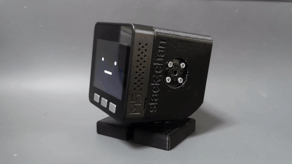

# 堆栈陈

Stack-chan是一个JavaScript驱动的M5Stack嵌入式超级卡哇伊机器人。

*视频（附英文字幕）：https://youtu.be/fZb_mF08xV0
*官方主题标签：[`#stackchan` | `#ｽﾀｯｸﾁｬﾝ`（日文）](https://twitter.com/search?q=%23stackchan%20OR%20%23%EF%BD%BD%EF%BE%80%EF%BD%AF%EF %BD%B8%EF%BE%81%EF%BD%AC%EF%BE%9D）。

＃＃ 特征

*:neutral_face: 显示可爱的脸
*:smile: 表情（高兴、生气、悲伤等）
*:smiley_cat: 自定义脸部
*:眼睛：扫视/凝视/凝视
*:speech_balloon: 说些话
*:灯泡: 插件 M5Units
*:cyclone: 驱动串行(TTL)/PWM伺服系统
*:game_die: 自己制作应用程序

＃＃ 内容

该存储库包含机器人的所有组件。

*__firmware__ : 固件的源代码。
*__case__ ：案例的立体光刻（STL）。
*__schematics__ ：原理图和电路板布局数据。

＃＃ 安装

### 组装板

*请参阅 [schematics/README.md](./schematics/README.md) 和 [case/README.md](./case/README.md)
*或者您可以获得预组装模块（即将推出）
### 将固件闪存到 M5Stack

*请参阅[固件/README.md](./firmware/README.md)

＃＃ 贡献

__功能请求/错误报告__非常受欢迎！请参阅[问题](https://github.com/meganetaaan/stack-chan/issues)页面来发布一些内容。

__想成为赞助商__吗？这将是我莫大的荣幸。请访问我的[赞助商](https://github.com/sponsors/meganetaaan/) 页面。

＃＃ 执照

该存储库的资源根据 Apache 2.0 版许可证分发。
请参阅[许可证](./许可证)。